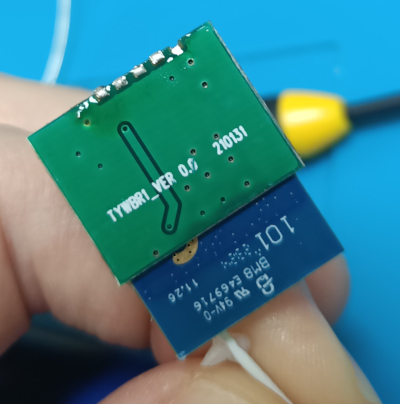
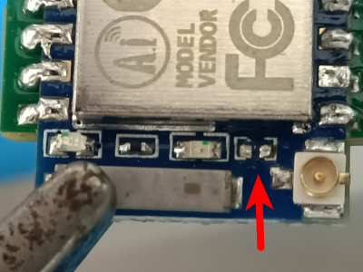
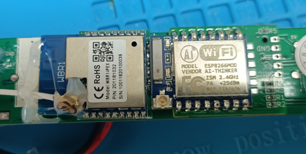
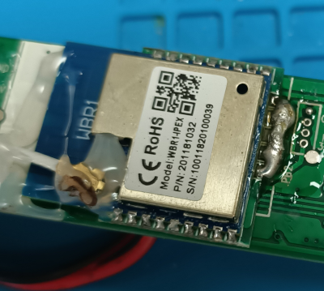
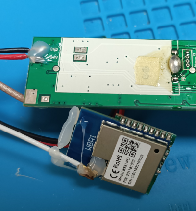
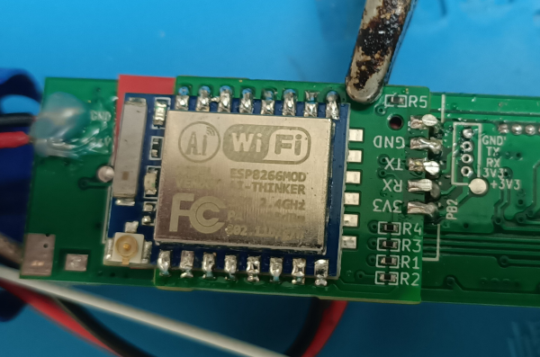
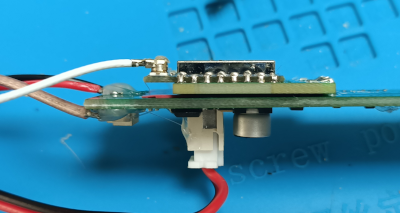
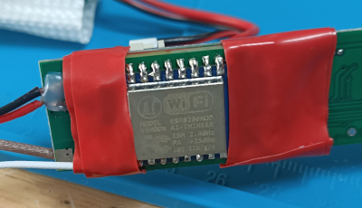
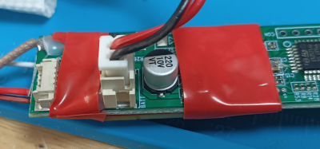

# ESP8266 Adapter Board for Zemismart ZM25TQ-TYW Tubular Motor

This is a PCB I designed for doing an ESP chip swap on the Zemismart ZM25TQ-TYW tubular motor.

It allows a simple direct replacement of the WBR1 microcontroller board, which rides on a carrier shim to
mate with the motorized blind itself. Communication happens over serial using the Tuya protocol, so ESPHome
can speak to it easily.

The carrier board in the motor tube is marked `TYWBR1_VER 0.0 210131`. The PCB in this repository is
designed to be a direct replacement for it, carrying an ESP-07 or ESP-07S (ESP-07S recommended).

You want to use the ESP-07 series because of the on-board SMA connector, which allows using the included antenna
with the tubular motor directly. You need to remove a 0 ohm resistor from these boards to use the external antenna.

The resistor to remove is shown below - the pads closest to the chip.

## Production

The [JLCPCB production files](jlcbpcb/production_files) I used for this board are included, use the SMD single-sided assembly service - all parts
are basic resistors which costs cents for assembly.

One consideration with production was I used the default PCB thickness - this worked fine, but a thinner PCB might
be better since castellate solder pads cost considerably more - and a little less height will help with the workaround
for soldering.

## Usage

**NOTE**: these instructions assume you know what you are doing. If this all seems to daunting, please don't plough
ahead anyway.

Make sure you flash your ESP with ESPHome before assembling everything! How to do this is described well elsewhere.
The ESPHome configuration to set the motor up as a [generic blind](esphome/generic-zemismart-zm25tq-tyw.yaml) is here.
I recommend customizing it for your use case (namely: set it up to auto-connect to your wifi, I've also added a required
secret for the fallback-wifi-password - you don't want that to default to open).

The motor comes apart fairly easily - just undo the screws (the design seems to have improved since the first one
I bought which required more force). I did have to desolder the reset switch to get it out. Take pictures while
you disassemble so you can re-assemble.

The image below shows the two boards side by side sitting on top of the blind motor board.

The easiest way to desolder this board is to add more solder to bridge all the pads, then use the soldering iron to
heat the blob up to liquid. There's tape underneath the chip, so use a small screw-driver to get the board up. Make
sure the solder is melted though - the traces underneath are fragile and can get lifted doing this (though there are
ways to repair it).

Showing the chip and the tape...

Use a desoldering gun or some solder wick to clean up the pads. I have a cheap desoldering station which works great.

I put red electrical tape over the white section of the mask to cover the test pads - these have 24V when the motor
is powered, so it's just some extra insulation.

The PCB doesn't have castellate pads - they add a considerable premium. The two possible solutions are to file the pads
on the edge till the open up, or to do a kind of careful solder bridge over the edge. I opted for the latter, but it
is is tricky - try what works best (I'll try the pseudo-castellation next time round).

The original PCB is hot glued down to provide support. I used electrical tape to cover the pseudo-castellations and the
top of the IPEX antenna. The final product looks like this, and fits back in the tube nicely.

And taped up:

 

When it's all back together, it's seamless - but maybe put a label on it so you know it's been chip-swapped (also
which specifies the name of the chip you put in - there's a lot of options you could go with).

### Will it work elsewhere?

Probably! I suspect this carrier board is pretty common. The Zemismart motor design has been improved and disassembled
quite well, so having the carrier board in hand made swapping it out a breeze.
